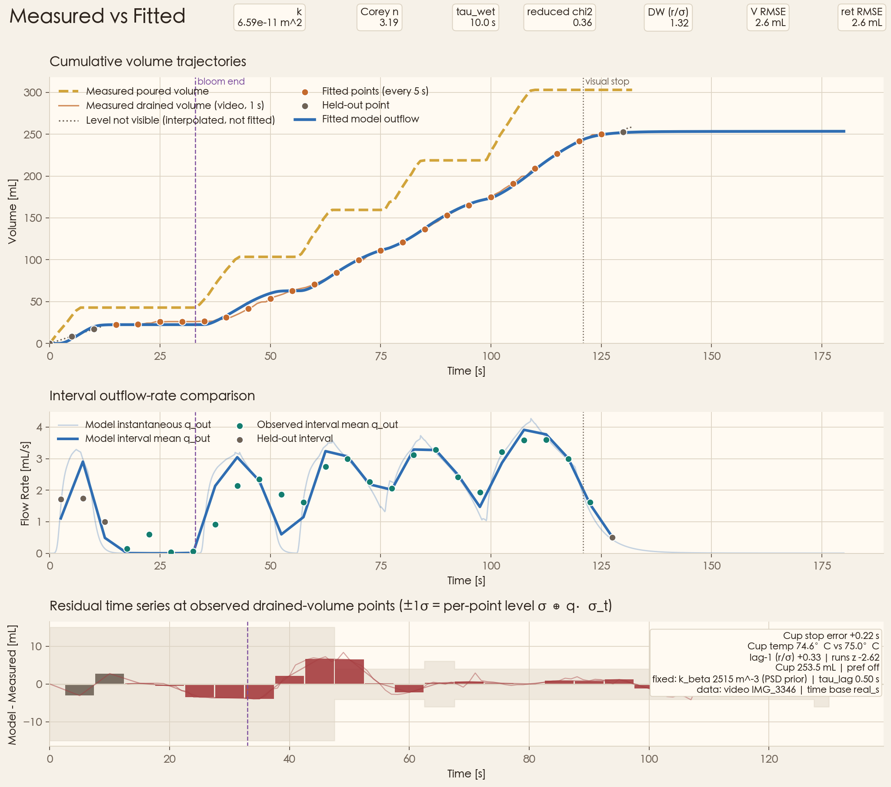

# V60 Pour-Over Physics Simulation

A physics-based simulator of V60 pour-over coffee. Given a recipe (dose, grind
size distribution, water temperature, pour schedule), it predicts how water
moves through the coffee bed, how much solute dissolves from each particle
size, and how the brew cools. It reports the outflow curve, drain time, water
left in the bed, cup temperature, TDS and extraction yield.

The model is calibrated against real brews filmed on a scale: the outflow
level, temperatures and final TDS are read from the video, and a small number
of physical parameters are fitted to them.



*Kinu 29, light roast, 20 g, 5.3 cm bed. Poured and drained volume read frame
by frame from the brew video, against the fitted model. Bottom panel:
residuals with the per-point measurement band.*

## What it is and is not

The simulator is a **reduced-order** model. It tracks a handful of water
pools, temperatures and per-size-bin solute masses as one coupled ODE system,
so a full brew runs in under a second. Every term is a named physical
mechanism (Darcy flow, capillary retention, diffusion out of grains,
convective heat loss) rather than a fitted curve.

It is **not** a CFD or multiphase PDE solver, and it does not resolve flow
within the bed in 3D. It is also not a black-box regressor: a parameter is
fitted only when the measurements can pin it down and it has a physical
meaning.

## Quick start

Requires Python with [uv](https://docs.astral.sh/uv/).

```bash
uv sync
uv run python -m unittest discover -s tests
```

Simulate a brew with the built-in light-roast defaults:

```python
from pour_over import V60Params, RoastProfile, PourProtocol, simulate_brew

params = V60Params.for_roast(RoastProfile.LIGHT)
results = simulate_brew(params, PourProtocol.standard_v60(), t_end=180)
print(f"TDS = {results['TDS_gl'][-1]:.1f} g/L, EY = {results['EY_pct'][-1]:.1f}%")
```

`results` holds time series for every state: outflow volume (`v_out_ml`),
slurry temperature (`T_C`), concentration (`TDS_gl`), extraction yield
(`EY_pct`), fast/slow contributions, and per-bin solute masses.

Generate the showcase figures (`v60_*.png`) from the calibrated state, then
refit the reference brew:

```bash
uv run python -m pour_over
```

Run the full calibration check on all four reference brews (fit, benchmark
gates, identifiability):

```bash
uv run python -m pour_over benchmark --all-cases
```

### Fitting your own brew

Put one directory per brew under `data/` containing:

- `*_flow_profile.csv` (or `*_flow_profile_video.csv`): one row per reading,
  with recipe metadata repeated on every row (`dose_g`, `bed_height_cm`,
  `brew_temp_C`, `ambient_temp_C`, `dripper_mass_g`, `final_tds_pct`, …) and
  the time series `time_s`, `poured_weight_g`, `drained_volume_ml`,
  `use_for_fit`. The files under `data/kinu_29_light/4:12/` are complete
  examples of both formats.
- `*_psd_bins.csv`: the particle-size distribution, generated from a
  [coffeegrindsize](https://github.com/latteine1217/coffeegrindsize) export
  with `uv run python -m pour_over.psd` (see `--help`).

Then fit it:

```python
from pour_over.fitting import generate_measured_flow_fit_artifacts

params, info = generate_measured_flow_fit_artifacts(
    csv_path="data/my_brew/my_brew_flow_profile.csv",
    plot_path="data/my_brew/my_brew_flow_fit.png",
    summary_path="data/my_brew/my_brew_flow_fit_summary.csv",
)
```

This writes the fitted parameters with confidence intervals, fit diagnostics
and three comparison figures. A fit takes about 40 s per brew.

## How the model works

### Water

Water is held in four explicit pools: free water ponded above the bed,
drainable pore water, capillary-held pore water, and water absorbed into the
grains. Every rate moves water from one pool to another, so poured water is
conserved exactly (the reported residual is about 1e-13 mL).

| Mechanism | Physics | Parameters |
|---|---|---|
| Absorption into grains | Grains take up water at a rate set by Lucas-Washburn scaling `γ(T)/μ(T)` | roast-dependent capacity |
| Bed wetting | A wetting state `w` grows from 0 to 1 with time constant `τ_wet` and opens both absorption and capillary retention | `τ_wet` (fitted) |
| Capillary retention | Young-Laplace head `2σ(T)/(ρ g r_pore)`, with pore radius `0.2·d32` from the measured PSD, sets how much water the bed can hold against gravity | from PSD |
| Flow through the bed | Darcy's law driven by the ponded head plus the saturated bed height, minus a capillary cutoff and a decaying CO₂ back-pressure | permeability `k` (fitted) |
| Partly saturated flow | Corey relative permeability `kr = S^n` on the drainable saturation | Corey `n` (fitted) |
| Fines clogging | Fines block pore throats (number-weighted) and deposit in the bed (volume-weighted); each pour briefly relieves the throats; swelling and head compaction lower porosity through Kozeny-Carman | clogging strength from PSD |
| Bypass | Flow along the filter ribs once the ponded head exceeds a few mm | fixed |
| Outlet | A 0.5 s hold-up for dripping from the outlet into the server | fixed |

### Extraction

- **Per size bin.** The measured PSD is kept as individual size bins, each
  with its own surface area and particle size.
- **Fast and slow pools.** In each bin, a broken outer shell (200 μm) releases
  solute quickly, and the intact core releases it slowly. Both follow the
  long-time limit of diffusion out of a sphere:
  - shell: `λ_fast = π²·D_eff/(2δ)²`;
  - core: `λ_slow = π²·D_eff/R_core²`.
- **Saturation.** Release slows as the liquid approaches the solubility
  ceiling `C_sat(T)`.
- **Temperature.** Diffusivity follows Stokes-Einstein,
  `D_eff = k_B T / (6π μ(T) r) / τ_tort`. This is the only temperature effect
  on release rates.
- **Transport.** Solute is carried through two stacked layers of the bed into
  the outflow.

Total extractable mass is fixed by roast (22% of dose for light roast). The
only fitted extraction parameter is the tortuosity `τ_tort`.

### Heat

- **Slurry.** Water and grounds in the cone, heated by incoming water at the
  kettle temperature and cooled to the room.
- **Dripper.** The ceramic cone, with heat capacity from its measured mass. It
  exchanges heat with the slurry through the wetted cone area, with a fitted
  heat-transfer coefficient `U`.
- **Server.** It mixes incoming coffee and cools to ambient.

Temperature feeds back into flow through water viscosity and into extraction
through diffusivity and solubility.

The ODE system is integrated with RK45 at `rtol 1e-7`, restarted at every
change in pour rate.

## Calibration

### Measurements

| Quantity | Source | Use |
|---|---|---|
| Dose, bed height, water and room temperature, dripper mass | direct measurement | fixed input |
| Particle-size distribution | photo of the grounds analysed with [coffeegrindsize](https://github.com/latteine1217/coffeegrindsize) | fixed input |
| Poured volume over time | scale under the server, read from the video | fixed input |
| Drained volume over time | liquid level on the server's graduations, read from the video | fitted |
| Server temperature over time | thermocouple display in the video | fitted |
| Outlet temperature | second thermocouple | held-out check |
| Final TDS | refractometer | fitted |

Each video reading carries its own uncertainty (4–15 mL depending on how
clearly the level is visible). Raw measurement files are never edited; any
correction is applied in memory and listed in the fit summary. The video
readout pipeline is documented in `tools/video/README.md`.

### Fitting procedure

The loss is a χ² over the measurements, each term divided by its measurement
uncertainty, plus weak priors that keep parameters in physical ranges. The
three physics blocks are fitted in order so that none of them absorbs
another's error:

1. **Hydraulics** (`k`, Corey `n`, `τ_wet`) against the outflow curve and stop
   time.
2. **Heat** (`U`) against the server temperature series. A brew with only a
   single cup temperature fits the server cooling rate instead.
3. **Extraction** (`τ_tort`) against the final TDS, compared as dissolved mass
   over the *measured* final volume so that a flow error cannot be hidden in
   the extraction parameter.

Each stage is a bounded least-squares fit from three starting points. Every
fitted parameter is reported with a 95% confidence interval.

Everything else is either measured, computed from measurements (pore size,
clogging strength and heat capacities), or one of these fixed assumptions:

| Assumption | Value | Role |
|---|---|---|
| Solubility ceilings `C_sat` fast / slow | 220 / 60–100 g/L by roast | limit on dissolved concentration |
| Solute molecular radii | 0.40 / 1.00 nm | Stokes-Einstein diffusivity |
| Broken-shell thickness | 200 μm | fast diffusion length and fast/slow split |
| Pore radius | 0.2 × `d32` | capillary retention |
| CO₂ back-pressure | 1 mm head, decaying over 35 s | early bloom flow |
| Bypass onset / width | 3 mm / 8 mm of ponded head | flow along filter ribs |
| Extractable fraction `max_EY` | 0.22 / 0.30 / 0.32 (light / medium / dark) | total soluble mass |
| Bed layers for solute transport | 2 | axial resolution |
| Server cooling rate | 3.7e-4 s⁻¹ | estimated from wall convection and radiation |

## Results

Reference brew `kinu29/4:12`
(`data/kinu_29_light/4:12/kinu29_light_20g_flow_fit_summary.csv`):

| Fitted parameter | Value | 95% CI |
|---|---|---|
| permeability `k` | 6.46e-11 m² | [6.36e-11, 6.75e-11] |
| Corey `n` | 3.13 | [2.13, 4.25] |
| wetting time `τ_wet` | 10.0 s (at lower bound) | up to 16.3 |
| dripper heat transfer `U` | 258 W/(m²K) | [184, 362] |
| tortuosity `τ_tort` | 7.47 | — |

| Fit quality | Value |
|---|---|
| outflow volume RMSE | 2.6 mL |
| stop-time error | +0.2 s |
| server temperature RMSE | 0.9 °C |
| cup temperature error | −0.4 °C |
| TDS error | +0.11 g/L (measured 11.56 g/L) |
| reduced χ² | 0.36 |

All four reference brews (`data/benchmark_suite_summary.csv`):

| Brew | Data source | reduced χ² | TDS error | Benchmark |
|---|---|---|---|---|
| Kinu 29, 4/12 (reference) | video | 0.36 | +0.11 g/L | pass |
| Kinu 27, 4/12 | video | 0.36 | +0.14 g/L | fails; residuals show a systematic pattern |
| Kinu 28, 4/20 | video | 0.50 | +0.03 g/L | pass |
| Kinu 29, 4/11 | hand log | 8.38 | +0.10 g/L | fails; hand-logged volumes read high |

A brew passes when its residuals are within measurement noise and show no
systematic pattern, and its water balance, cup temperature and TDS are within
set tolerances. Fitted permeabilities agree across the three video brews
(6.5–7.7e-11 m²).

All of these numbers are **calibration** errors on the brew each parameter
set was fitted to, not prediction errors on a new brew.

## What to trust

**Well constrained.** These quantities are fitted to direct time-series
measurements, and their parameters agree across brews:

- the outflow curve, drain time and water retained in the bed;
- server and cup temperatures.

Predictions for a recipe that differs from the calibrated brews (another pour
schedule or water temperature) have not yet been checked against a new
measured brew.

**Use with care:**

- **Absolute TDS for a new grind or a different roast date.** Each brew has
  one TDS reading and one fitted extraction parameter, so the TDS match above
  is not evidence that extraction is predicted correctly. The fitted
  tortuosity varies by a factor of 2.3 across brews and does not follow grind
  size. Reusing it between two brews of the same beans and grind one day apart
  predicts TDS within 0.7 g/L. Across grind settings and roast dates, the
  error reaches 3.7 g/L. The cause (bean aging, TDS measurement, or a missing
  grind effect in extraction) is still being tested.
- **Grind sweeps.** Changing grind size rescales permeability, but the fines
  clogging is computed from the measured PSD and does not change with a
  simulated grind change. A new grind needs a new PSD measurement for a
  reliable prediction.
- **The second pour after the bloom.** When a pour restarts an outflow that
  had stopped, the model's outflow arrives 2–4 s early. The total volume is
  right.
- **`τ_wet`** is better read as a shape parameter than as a measured wetting
  time. It is set mostly by the later pours, not the bloom, and differs by a
  factor of four across brews.
- **Server temperature below about 150 mL** in the server is less accurate,
  because the dry glass wall is not modelled. These readings are excluded from
  the fit.
- **Confidence intervals** are computed with other parameters held fixed, so
  they understate the true uncertainty.

**Not measured, assumed:** outlet diameter, filter paper resistance, paper
water hold-up, server heat capacity (back-solved), and the absolute PSD scale
(±45% systematic uncertainty).

## Repository layout

```
pour_over/
├── core.py            # coupled ODE engine (simulate_brew)
├── params.py          # closures, V60Params, RoastProfile, PourProtocol
├── constant.py        # physical constants and measured fixed inputs
├── psd.py             # PSD ingestion (raw export → model bins)
├── measured_io.py     # measured CSV loading, measurement constants
├── preprocess.py      # in-memory measurement corrections
├── observation.py     # outlet hold-up, server node, stop-time rule
├── fitting.py         # χ² objective and staged fit
├── benchmark.py       # four-brew benchmark and gates
├── identifiability.py # parameter identifiability scans and CI
├── analysis.py        # sensitivity and grind optimisation
├── showcase_state.py  # loads the current calibrated state
└── viz.py             # figures
tools/video/           # brew-video readout pipeline
data/<grinder>_<roast>/<date>/   # per-brew measurements, PSD, fit outputs
docs/                  # literature map, experiment log
```

Raw videos and photos are not version-controlled; per-frame readouts are kept
under `data/<case>/video/`.

## References

The closure-by-closure literature map is in `docs/literature_map.md`. Core
sources:

- Corrochano et al. (2015), *Journal of Food Engineering* — coffee packed-bed
  permeability and Kozeny-Carman limits. DOI `10.1016/j.jfoodeng.2014.11.006`
- Moroney et al. (2015), *Chemical Engineering Science* — double-porosity coffee
  extraction with fast surface release and slow intragranular diffusion.
  DOI `10.1016/j.ces.2015.06.003`
- Moroney et al. (2019), *PLOS ONE* — extraction uniformity in porous coffee beds.
  DOI `10.1371/journal.pone.0219906`
- Cameron et al. (2020), *Matter* — PSD, inhomogeneous flow and extraction
  reproducibility. DOI `10.1016/j.matt.2019.12.019`
- Crank (1975), *The Mathematics of Diffusion* — spherical-grain diffusion
- Brooks & Corey (1964) — relative permeability of unsaturated porous media
- Washburn (1921), *Physical Review* — capillary imbibition scaling

Model development, rejected mechanisms and every refit are recorded in
`docs/experiment_log.md`.

## License

MIT — see `LICENSE`.
